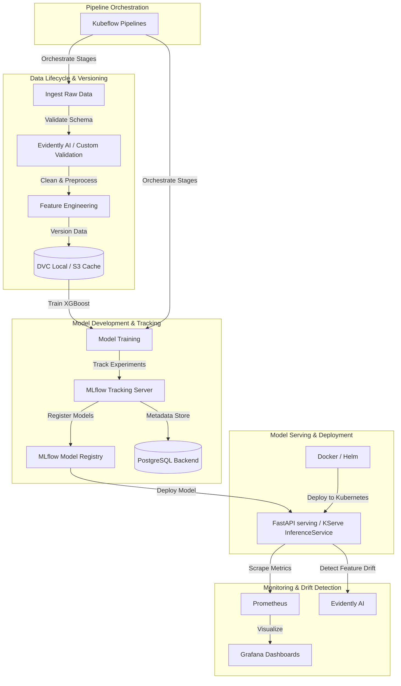

# Enterprise Telco Customer Churn Prediction MLOps Platform

An enterprise-grade Customer Churn Prediction MLOps platform built to run locally on a laptop, reflecting real-world scalable production architecture. The platform covers the entire machine learning lifecycle: data ingestion, automated validation, model development, tracking, orchestration, serving, containerization, and continuous monitoring.

---

## 1. System Architecture

Below is the design of the end-to-end MLOps platform:



---

## 2. Directory Structure

The project conforms to the following layout:

```text
mlops-customer-churn-model/
├── .dvc/                  # DVC configuration and metadata
├── .github/               # GitHub workflows for CI/CD pipelines
├── artifacts/             # Local runtime artifacts (e.g., plots, tables)
├── configs/               # Centralized configuration yaml files
├── data/                  # Data directories (raw, processed, external)
│   ├── raw/
│   ├── processed/
│   └── external/
├── docs/                  # In-depth system documentation and guides
├── helm/                  # Helm charts for Kubernetes deployment
├── kserve/                # KServe inference specifications
├── kubeflow/              # Kubeflow Pipeline components and DAGs
├── manifests/             # Kubernetes YAML manifests (Services, Deployments)
├── mlruns/                # Local MLflow experiments tracker
├── models/                # Local model serializations
├── monitoring/            # Prometheus config and Grafana dashboards
├── notebooks/             # Exploratory research notebooks
├── pipelines/             # Local DVC pipeline definitions
├── src/                   # Package codebase for packaging and execution
│   └── customer_churn/    # Core Python sub-package
├── tests/                 # Unit and integration test suites
├── Dockerfile             # Core API serving containerization
├── Makefile               # Local developer shortcuts
├── README.md              # Project root documentation (this file)
├── docker-compose.yml     # Local services orchestrator (MLflow, PG, S3)
├── dvc.yaml               # DVC pipeline stages
├── params.yaml            # Pipeline hyperparameter tracker
├── pyproject.toml         # Python tool configurations (mypy, pytest, black)
├── requirements.txt       # Base Python dependencies
└── setup.py               # Package setup file for local install
```

---

## 3. Getting Started Locally

### Prerequisites
- Python 3.12+
- Docker & Docker Compose
- Make (optional, but recommended)

### Setup Virtual Environment
Run the following helper targets to setup your local environment:

```bash
# Initialize Python virtualenv
python3 -m venv .venv

# Activate virtualenv
source .venv/bin/activate

# Install package in editable mode with development & training dependencies
make install
```

### Verification
Run the unit test suite to verify code format, styles, and test functionality:
```bash
# Run unit tests
make test

# Run formatters and linters
make lint
```


---

## 4. Component Documentation

### 4.1 Configuration and Logger (Phase 2)
* **Configuration Loader** ([config.py](file:///home/ubuntu/mlops/mlops-customer-churn-model/src/customer_churn/config.py)): Reads YAML config files via dot notation, supports overriding any parameter with uppercase environment variables, and automatically casts types.
* **Structured Logging** ([logger.py](file:///home/ubuntu/mlops/mlops-customer-churn-model/src/customer_churn/logger.py)): Sets up rotating structured JSON files (writing to `artifacts/app.json.log` via `pythonjsonlogger`).

### 4.2 Data Version Control (Phase 3)
* **Storage Remote**: Configured S3 remote bucket `s3://dvc-cache` hosted on MinIO (`http://localhost:9000`).
* **Security Model**: Credentials (`access_key_id`, `secret_access_key`) are saved strictly to the git-ignored `.dvc/config.local` to prevent committing secrets to source control.
* **Infrastructure Autocreate**: The bucket `dvc-cache` is provisioned automatically by our `createbuckets` service container in Docker Compose.

### 4.3 Data Ingestion (Phase 4)
* **Ingestion Script** ([ingest.py](file:///home/ubuntu/mlops/mlops-customer-churn-model/src/customer_churn/ingest.py)): Downloads raw CSV data from a stable public raw repository URL to `data/raw/telco_customer_churn.csv`.
* **DVC Stage Ingestion**: Configured `dvc.yaml` to run the ingest module and automatically cache the raw CSV outputs locally.

### 4.4 Data Validation (Phase 5)
* **Validation Script** ([validate.py](file:///home/ubuntu/mlops/mlops-customer-churn-model/src/customer_churn/validate.py)): Asserts schema compliance (column presence), row threshold criteria, range constraints, missing values metrics, and target column uniqueness.
* **Validation Report**: Outputs a structured validation summary to [validation_report.json](file:///home/ubuntu/mlops/mlops-customer-churn-model/artifacts/validation_report.json) mapping validation outcomes.
* **DVC Stage Validation**: Integrated schema checks into `dvc.yaml` as the second pipeline stage.

### 4.5 Data Preprocessing (Phase 6)
* **Preprocessing Script** ([preprocess.py](file:///home/ubuntu/mlops/mlops-customer-churn-model/src/customer_churn/preprocess.py)): Drops arbitrary identifiers (`customerID`), cleans numeric cast issues in `TotalCharges` (replacing missing elements with 0.0), maps target labels to binary integers, and splits datasets using stratified configurations.
* **Outputs**: Splits raw data into versioned datasets: [train.csv](file:///home/ubuntu/mlops/mlops-customer-churn-model/data/processed/train.csv) and [test.csv](file:///home/ubuntu/mlops/mlops-customer-churn-model/data/processed/test.csv).
* **DVC Stage Preprocessing**: Configured DVC pipeline to run preprocessing with hyperparameter parameters (`train.test_size` and `train.random_state`).

### 4.6 Feature Engineering (Phase 7)
* **Feature Engineering Script** ([features.py](file:///home/ubuntu/mlops/mlops-customer-churn-model/src/customer_churn/features.py)): Fits `StandardScaler` and `OneHotEncoder` `ColumnTransformer` only on the train set to prevent leakage.
* **Outputs**: Serialized [preprocessor.pkl](file:///home/ubuntu/mlops/mlops-customer-churn-model/models/preprocessor.pkl) and transformed datasets [train_features.csv](file:///home/ubuntu/mlops/mlops-customer-churn-model/data/processed/train_features.csv) and [test_features.csv](file:///home/ubuntu/mlops/mlops-customer-churn-model/data/processed/test_features.csv).
* **DVC Stage Features**: Run preprocessing pipeline and register outputs.

### 4.7 Model Training (Phase 8)
* **Training Script** ([train.py](file:///home/ubuntu/mlops/mlops-customer-churn-model/src/customer_churn/train.py)): Loads train features, reads XGBoost hyperparameters from `params.yaml`, fits the classifier model, and serializes the model.
* **Outputs**: Serialized [model.pkl](file:///home/ubuntu/mlops/mlops-customer-churn-model/models/model.pkl).
* **DVC Stage Training**: Automate model fitting and serializations.

### 4.8 Model Evaluation (Phase 9)
* **Evaluation Script** ([evaluate.py](file:///home/ubuntu/mlops/mlops-customer-churn-model/src/customer_churn/evaluate.py)): Loads test splits, transforms them via `preprocessor.pkl`, generates inferences using `model.pkl`, computes classification performance metrics (Accuracy, Precision, Recall, F1, ROC-AUC), and exports the values.
* **Outputs**: Creates the metrics json file [metrics.json](file:///home/ubuntu/mlops/mlops-customer-churn-model/artifacts/metrics.json).
* **DVC Stage Evaluation**: Configured evaluation stage tracking test split data, model state, and outputting local metrics.

### 4.9 MLflow Tracking (Phase 10)
* **MLflow Tracking Integration** ([train.py](file:///home/ubuntu/mlops/mlops-customer-churn-model/src/customer_churn/train.py) & [evaluate.py](file:///home/ubuntu/mlops/mlops-customer-churn-model/src/customer_churn/evaluate.py)): Configures the scripts to log run parameters, performance metrics, and model objects to the local MLflow tracking server (backed by PostgreSQL and MinIO S3 storage). The pipeline automatically shares the active run ID across independent stages via [mlflow_run_id.txt](file:///home/ubuntu/mlops/mlops-customer-churn-model/artifacts/mlflow_run_id.txt).### 4.10 MLflow Model Registry (Phase 11)
* **Model Registration** ([register_model.py](file:///home/ubuntu/mlops/mlops-customer-churn-model/src/customer_churn/register_model.py)): Connects to the MLflow server, registers the new model candidate, compares its F1-score against the model currently holding the `production` alias, and promotes it using the modern Model Aliases API (not deprecated stages) if the performance is strictly improved.
* **Output Report**: Emits the outcome to [registration_status.json](file:///home/ubuntu/mlops/mlops-customer-churn-model/artifacts/registration_status.json).

### 4.11 S3 and PostgreSQL Backend (Phases 12 & 13)
* **Infrastructure Orchestration** ([docker-compose.yml](file:///home/ubuntu/mlops/mlops-customer-churn-model/docker-compose.yml)): Defines local services (PostgreSQL for metadata storage, MinIO for S3-compatible artifact storage, and the serving API) with restart policies and healthchecks.
* **Database Target**: postgres alpine volume maps to `/var/lib/postgresql` (resolving Alpine-specific permission constraints).
* **Auto-Bucket Helper**: A helper service `createbuckets` initializes MinIO buckets (`mlflow-artifacts` and `dvc-cache`) immediately upon MinIO health confirmation.

### 4.12 Kubeflow Orchestration (Phases 14, 15 & 16)
* **Kubernetes Local Engine**: Documented local vCluster environment setup and Kubeflow Standalone deployment.
* **KFP v2 Python Components** ([kubeflow/components/](file:///home/ubuntu/mlops/mlops-customer-churn-model/kubeflow/components/)): Defined 6 custom KFP v2 components (mapping to raw pipeline stages) with environment overrides.
* **Pipeline Compiler** ([kubeflow/pipeline.py](file:///home/ubuntu/mlops/mlops-customer-churn-model/kubeflow/pipeline.py)): Compiled the pipeline DAG into the ready-to-run [kubeflow/pipeline.yaml](file:///home/ubuntu/mlops/mlops-customer-churn-model/kubeflow/pipeline.yaml).

### 4.13 FastAPI Model Server & Dockerization (Phases 17 & 18)
* **API Server** ([serve.py](file:///home/ubuntu/mlops/mlops-customer-churn-model/src/customer_churn/serve.py)): Implements prediction endpoints `/predict`, `/predict/batch`, health check `/health`, and Prometheus `/metrics`. Exposes custom logging and metrics.
* **Optimized Dockerfile** ([Dockerfile](file:///home/ubuntu/mlops/mlops-customer-churn-model/Dockerfile)): Separates training and serving dependencies via [requirements-serve.txt](file:///home/ubuntu/mlops/mlops-customer-churn-model/requirements-serve.txt). It installs only serving dependencies, uninstalls heavy CUDA/Nvidia GPU libraries (`nvidia-nccl-cu12`) to keep it CPU-only, and copies only the virtualenv (`/opt/venv`), `configs/`, and `models/` into the runner stage. This secures the container by removing raw python source code (`src/` and `setup.py`) and **reduces the image size from 2.04 GB to 695 MB**.
* **Ignore Caches** ([.dockerignore](file:///home/ubuntu/mlops/mlops-customer-churn-model/.dockerignore)): Minimizes the build context to under 500 kB by ignoring local datasets (`data/`), tests, documentation, Helm charts, and local caches.

### 4.14 Kubernetes Deployments & Helm Charting (Phases 19, 20 & 21)
* **vCluster Multi-Node Topology** ([vcluster.yaml](file:///home/ubuntu/mlops/mlops-customer-churn-model/vcluster.yaml)): Establishes a 4-node virtual cluster using the Docker driver. Overcomes Ubuntu Noble containerd CRI issues on WSL2 by mounting [containerd-config.toml](file:///home/ubuntu/mlops/mlops-customer-churn-model/containerd-config.toml) to enable the containerd CRI plugin.
* **K8s Manifests** ([manifests/](file:///home/ubuntu/mlops/mlops-customer-churn-model/manifests/)): Includes namespace configuration, configmaps, deployments, routing services, and ingress setups.
* **Helm Charts** ([helm/customer-churn-app/](file:///home/ubuntu/mlops/mlops-customer-churn-model/helm/customer-churn-app/)): Parameterizes resource specifications, replica sizes, and environment variables into configurable `Chart.yaml` and `values.yaml` templates.
* **KServe Serving** ([kserve/inferenceservice.yaml](file:///home/ubuntu/mlops/mlops-customer-churn-model/kserve/inferenceservice.yaml)): Defines a serverless Knative InferenceService deployed in the virtual cluster after registering the KServe CRDs.


### 4.15 Observability & Monitoring (Phases 22 & 23)
* **Prometheus Targets** ([monitoring/prometheus.yaml](file:///home/ubuntu/mlops/mlops-customer-churn-model/monitoring/prometheus.yaml)): Configures the scrape agent to poll `/metrics` on our API service inside the compose network.
* **Grafana Dashboards** ([monitoring/grafana/dashboards/dashboard.json](file:///home/ubuntu/mlops/mlops-customer-churn-model/monitoring/grafana/dashboards/dashboard.json)): Visualizes operational latency, request error rates, throughput, and business indicators (churn rate).

### 4.16 Data Drift & Retraining Pipeline (Phases 24 & 25)
* **Drift Detector** ([drift_detector.py](file:///home/ubuntu/mlops/mlops-customer-churn-model/src/customer_churn/drift_detector.py)): Compares live incoming inference data with training baselines using Evidently AI's data drift presets. Exports HTML/JSON drift summaries to `artifacts/`.
* **Retraining Pipeline** ([retrain.py](file:///home/ubuntu/mlops/mlops-customer-churn-model/src/customer_churn/retrain.py)): Checks drift proportions and runs `dvc repro` in a subprocess to run the retraining pipeline if drift exceeds the 50% threshold.

### 4.17 CI/CD Automation & E2E Validation (Phases 26 & 27)
* **GitHub Actions** ([.github/workflows/ci.yaml](file:///home/ubuntu/mlops/mlops-customer-churn-model/.github/workflows/ci.yaml)): Triggers code styling checks (Black), code auditing (Flake8), static typing analysis (MyPy), unit test executions, and a Docker compile check on every commit.
* **E2E Integration** ([tests/test_e2e.py](file:///home/ubuntu/mlops/mlops-customer-churn-model/tests/test_e2e.py)): Orchestrates the complete pipeline loop from raw data download to metric evaluation, registration, serving client inference, and drift checks.

---

## 5. Developer CLI Reference (Makefile)

The project includes an enterprise-grade `Makefile` providing shortcuts for standard local activities:

```bash
# Display help and available commands
make help

# Set up local virtual environment
make setup

# Install dependencies and local package in dev mode
make install

# Format code with Black
make format

# Run flake8 and mypy checks
make lint

# Run pytest unit and integration test suite
make test

# Execute local DVC pipeline
make pipeline

# Build serving Docker image (leverages .dockerignore)
make build-image

# Run serving container locally on port 8000
make run-container

# Stop and remove local serving container
make stop-container

# Remove temporary python build and cache directories
make clean

# Remove serving container and image
make docker-clean
```

---

## 6. vCluster Kubernetes Deployment Guide

This section describes how to set up the multi-node vCluster and deploy the serving container and KServe InferenceService.

### Step 1: Create the 4-Node vCluster
We use the Docker driver with a custom configuration to provision 4 worker nodes and mount containerd settings (enabling the CRI plugin on WSL2):
```bash
# Create the cluster pointing to vcluster.yaml configuration
vcluster create my-cluster --driver docker --connect=false -f vcluster.yaml
```

### Step 2: Connect to the vCluster Context
Set the active context in your local shell to point to the virtual cluster:
```bash
vcluster connect my-cluster
```
Verify the nodes are running and ready:
```bash
kubectl get nodes -o wide
```

### Step 3: Load the Serving Image onto Worker Nodes
Since local containers do not share the host's image store without containerd storage enabled on the host, import the built image directly to all 4 worker nodes:
```bash
# Build the optimized image first
make build-image

# Import the image to all 4 containerd runtime node containers
for node in worker-1 worker-2 worker-3 worker-4; do
  echo "Importing to $node..."
  docker save customer-churn-api:latest | docker exec -i vcluster.node.my-cluster.$node ctr -n k8s.io images import -
done
```

### Step 4: Deploy the Application Manifests
Deploy the namespace, service, ingress, configmap, and deployment to the vCluster:
```bash
kubectl apply -f manifests/
```
Verify the pods are running and scheduled onto the worker nodes:
```bash
kubectl get pods -n customer-churn
```

### Step 5: Install KServe CRDs
Install the required KServe Custom Resource Definitions via Helm:
```bash
helm install kserve-crd oci://ghcr.io/kserve/charts/kserve-crd \
  --version v0.18.0 \
  --namespace kserve \
  --create-namespace
```

### Step 6: Deploy KServe InferenceService
Apply the serverless KServe InferenceService specification:
```bash
kubectl apply -f kserve/inferenceservice.yaml
```
Verify the InferenceService registration:
```bash
kubectl get inferenceservice -n customer-churn
```

