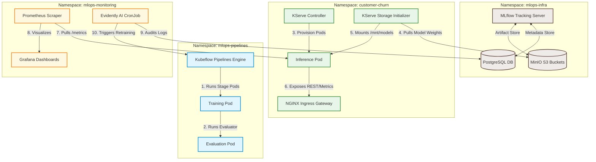

# Production-Ready Enterprise MLOps Architecture

This document describes the production-ready architecture, network topologies, and data separation strategies for the Customer Churn Prediction platform. It outlines how components are decoupled, secured, and scaled at an enterprise level.

---

## 1. Enterprise MLOps Topology

In a production environment, the platform is divided into three distinct planes: **Orchestration & Training**, **Metadata & Registry**, and **Inference Serving**. This ensures that high-throughput serving workloads are completely isolated from compute-heavy training workloads and storage layers.



---

## 2. Separation of Concerns (Inference vs. Training)

At an enterprise level, the serving container (`customer-churn-api`) must remain **lean, secure, and optimized for latency**. 

### 2.1 The Anti-Pattern: Monolithic Dependencies
Including libraries like `mlflow`, `dvc`, and `kfp` in the serving image leads to several production risks:
- **Excessive Image Size**: A 2 GB+ container takes longer to pull, deploy, and scale (e.g., during horizontal pod autoscaling - HPA).
- **Vulnerability Surface**: Heavy libraries import hundreds of transitive packages, dramatically increasing CVE risk.
- **Unnecessary Runtime Overhead**: Serving engines only need to perform matrix math and handle requests. They do not run pipelines or log training epochs.

### 2.2 The Production Pattern: Decoupled Registry and Storage Initializer
Instead of building MLflow or S3-download clients into the API code, we leverage the **KServe Storage Initializer** pattern:
1. **Model Promotion**: When the training pipeline registers a model and marks it as `production`, it saves the model files (e.g. `model.pkl`, `preprocessor.pkl`) to a specific S3 path (e.g. `s3://models/customer-churn/v1/`).
2. **KServe Deployment**: The KServe `InferenceService` manifest declares the `storageUri` pointing to that S3 path:
   ```yaml
   spec:
     predictor:
       containers:
       - name: kserve-container
         image: customer-churn-api:latest  # Slim 400MB image (no mlflow, no dvc)
       # KServe automatically injects an init container to pull files to /mnt/models
       storageUri: "s3://models/customer-churn/v1/"
   ```
3. **Slim Serving API**: The FastAPI application simply reads the files from `/mnt/models` and serves predictions. It is unaware of MLflow, MinIO, or S3 credentials.

---

## 3. Production Dependency Breakdown

To support this decoupled architecture, dependencies are divided into distinct packages:

| Group | Target Environment | Key Libraries Included | Purpose |
|---|---|---|---|
| **Serving (Slim)** | Kubernetes Inference Pods | `fastapi`, `uvicorn`, `pandas`, `numpy`, `scikit-learn`, `xgboost`, `prometheus-client`, `psycopg2-binary` | Expose API endpoints, parse request payloads, run fast predictions, expose `/metrics`, and write transaction logs. |
| **Pipeline (Heavy)** | Kubeflow / Local Training | `mlflow`, `dvc`, `kfp`, `evidently`, `boto3`, `sqlalchemy` | Run pipelines, log metrics/params, register models to the central catalog, compile pipelines, and calculate drift. |
| **Development** | CI/CD Runner / Local PC | `pytest`, `black`, `flake8`, `mypy` | Validate code style, run unit tests, and check types before container build. |

---

## 4. Production Security & Data Flow

1. **Authentication and RBAC**:
   - Serving pods do not have access to training databases or administrative S3 buckets.
   - The KServe controller uses a read-only Kubernetes `Secret` containing S3 credentials to pull model weights during pod startup.
2. **Inference Logging**:
   - Serving pods write incoming requests and predictions to a lightweight, partitioned PostgreSQL logging table.
   - This logging is decoupled from the transaction database to prevent database lockups under high traffic.
3. **Data Drift Audits**:
   - A separate `Evidently AI` CronJob runs periodically (e.g., nightly) to pull serving logs from Postgres, compare them to baseline training splits, and trigger retraining if drift limits are breached.
